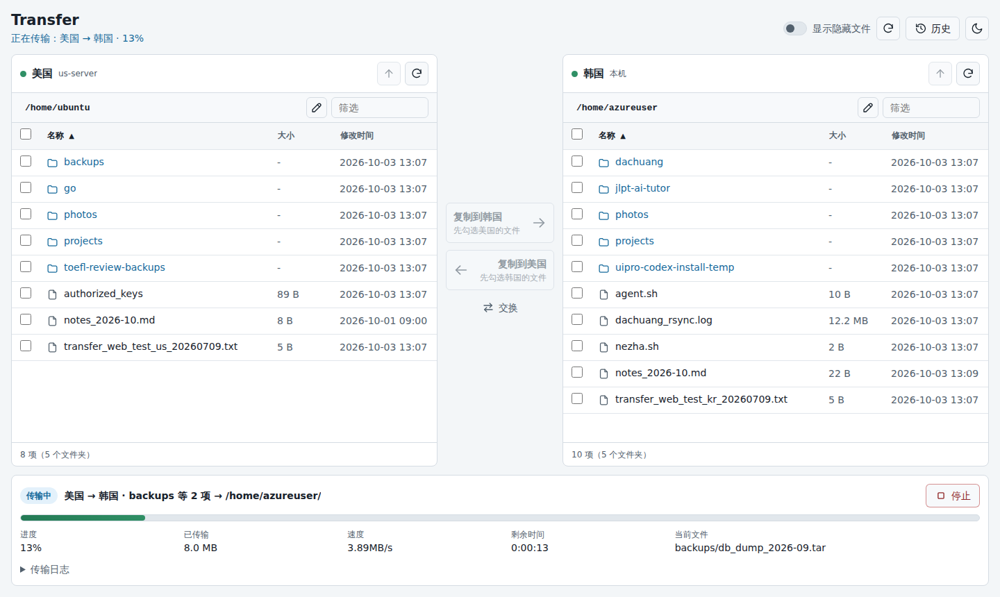
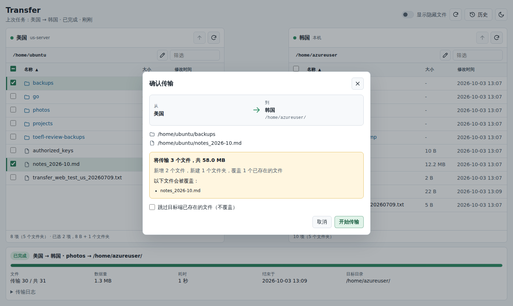
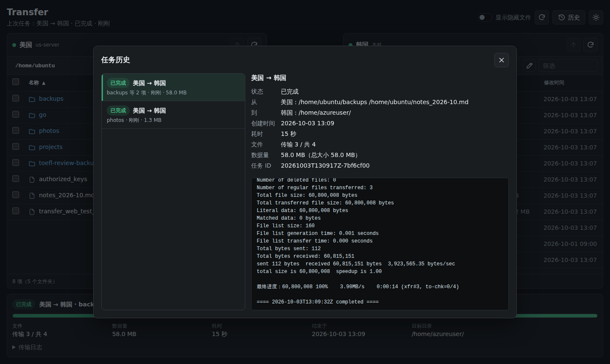
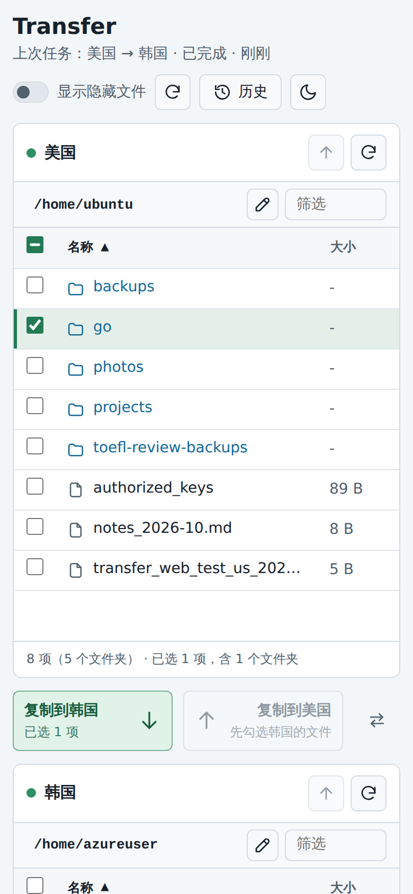

# Transfer Web

我有两台服务器，经常要在它们之间搬文件。每次都 ssh 上去敲 rsync 有点烦，用 WinSCP 这类工具又要先下载到本地再上传，绕了一大圈。所以写了这个小工具：在浏览器里左右两栏分别显示两台服务器的目录，勾选文件、点一下按钮，文件就由 rsync 直接在两台服务器之间传过去，不经过我自己的电脑。



## 能做什么

左右两栏各对应一台服务器，叫什么名字、显示哪个目录都写在配置文件里。勾选文件或文件夹，点中间的“复制到某某”，就会把它们复制到另一侧当前所在的目录。

开始之前会先做一次预检，告诉你这次要传多少东西、哪些文件会覆盖目标端已有的同名文件。不想覆盖的话，勾上“跳过目标端已存在的文件”就行。



传输过程中能看到整体进度、速度、预计剩余时间和正在传的文件。中途停掉或者断网都没关系，下次再传同一个文件会从断开的地方接着传。前一个任务还没传完时再提交新任务，新任务会排队等着。历史记录里能查到以前每次传了什么，以及当时的完整日志。



在手机上也能用，两栏会改成上下排列，按钮上的箭头也跟着变成上下方向。



## 先说安全

能打开这个页面的人，就能读写配置里那几个目录下的任何文件，包括 `.ssh/authorized_keys`、`.bashrc` 这种。说白了，这跟把两台机器的 shell 交出去差不多。所以千万别把它直接挂到公网上。

为此，它默认只认 Tailscale：服务只监听 `127.0.0.1`，由 `tailscale serve` 把页面发布到你自己的 tailnet 里，程序只接受带着 Tailscale 身份的请求。直接访问端口、经 Funnel 从公网来的、从打了 tag 的设备来的请求，一律拒绝。细节见后面的“用 Tailscale 访问”。

## 一键安装

在运行本服务的那台机器上：

```bash
git clone https://github.com/Kairitsu/transfer-web.git
cd transfer-web
sudo ./install.sh
```

脚本会依次：

1. 装好 `rsync`、`ssh`、`python3`，没装 Tailscale 的话也一起装上，然后让你登录 Tailscale；
2. 把程序复制到 `/opt/transfer-web`，生成 `/etc/transfer-web/config.ini`，并把 `allowed_users` 设成这台机器所属的 Tailscale 账号；
3. 用 `tailscale serve` 把页面发布到 tailnet；
4. 装好 systemd 服务并启动，以执行 `sudo` 的那个用户运行（可以用 `--user` 换），最后打印出访问地址。

在另一台服务器上执行 `sudo ./install.sh --remote`，它只装 Tailscale、`rsync` 和 `python3`，最后告诉你这台机器在 Tailscale 里叫什么，填到配置的 `host` 里就行。

几点说明：

- Tailscale 用的是它的官方安装源，没有把 Tailscale 程序本身放进这个仓库：它是要用 root 跑的系统服务，跟着系统包管理器更新才能及时拿到安全补丁；机器上本来就装了 Tailscale 的话，再塞一份进来反而会打架。
- tailnet 第一次用 `tailscale serve` 时要开启 HTTPS 证书，脚本运行到这一步会给出链接，打开后点一下 Enable 就行。
- 想无人值守安装，可以把 [auth key](https://login.tailscale.com/admin/settings/keys) 放在环境变量里：`sudo TS_AUTHKEY=tskey-auth-... ./install.sh`。
- HTTPS 443 端口已经被别的 `tailscale serve` 占用时，脚本什么都不改就会停下来，用 `--https-port 8443` 换个端口再跑。
- 重复运行是安全的，不会覆盖已有的配置，可以拿来升级代码。改了配置里 local 端点的 `root` 之后也要重新运行一次，它会把新目录加进 systemd 允许写入的范围。

## 准备工作

用 `install.sh` 安装的话，下面这些都会自动装好。

运行这个服务的那台机器需要 Python 3.10 以上、`rsync`、`ssh` 和 Tailscale，不用装任何 Python 第三方包。另一台服务器需要有 `rsync` 和 `python3`（列目录时会用到），再准备一个能用密钥登录的 SSH 账号。

rsync 有个限制：它不能直接在两台远端机器之间传文件，所以两台服务器里有一台必须是运行本服务的机器。

## 配置

用安装脚本装的话，配置在 `/etc/transfer-web/config.ini`。一个最简单的配置大概长这样：

```ini
[ui]
left = us
right = kr

[endpoint:us]
name = 美国
type = ssh
host = us-server
user = ubuntu
root = /home/ubuntu
identity_file = /home/azureuser/.ssh/us_server_key

[endpoint:kr]
name = 韩国
type = local
root = /home/azureuser
```

每个 `[endpoint:…]` 就是一台服务器：`type = local` 是运行本服务的这台，`type = ssh` 是需要连过去的那台，`name` 是页面上显示的名字，`root` 决定了页面里能看到哪个目录。如果配置了不止两台，页面上可以用下拉框切换每一栏显示哪台。其他可选项（端口、`known_hosts`、历史条数、日志保留天数等）在 [`config.example.ini`](config.example.ini) 里都有注释。

改完之后执行 `sudo systemctl restart transfer-web`（或者重新运行一次 `sudo ./install.sh`）生效。

不用安装脚本、想手动跑的话：

```bash
cp config.example.ini config.ini   # 然后按上面改好
python3 app.py --config config.ini
sudo tailscale serve --bg 8756
```

再打开 `tailscale serve status` 显示的 `https://…ts.net` 地址。直接打开 <http://127.0.0.1:8756> 会被拒绝，因为请求没经过 Tailscale；只是想在自己电脑上试一下的话，可以临时在配置的 `[server]` 里写 `require_tailscale = no`。不加 `--config` 时，程序会依次查找环境变量 `TRANSFER_WEB_CONFIG`、`/etc/transfer-web/config.ini` 和仓库根目录下的 `config.ini`。

## 长期运行

`install.sh` 已经替你做了这一步，下面是手动部署时的做法。仓库里有一份 systemd 配置 [`deploy/transfer-web.service`](deploy/transfer-web.service)，默认假设代码放在 `/opt/transfer-web`、配置放在 `/etc/transfer-web/config.ini`：

```bash
sudo cp deploy/transfer-web.service /etc/systemd/system/
sudo systemctl daemon-reload
sudo systemctl enable --now transfer-web
```

里面的 `User=azureuser` 要改成你自己的用户名，最好就是平时拥有这些文件的那个账号；`ReadWritePaths` 要改成配置里 local 端点的 `root`，服务只能往这些目录里写。尽量别用 root 跑：root 收到的文件会沿用远端机器上的属主，之后你可能改不动它们。实在要用 root，就在 local 端点里加一行 `owner = 你的用户名`。

## 用 Tailscale 访问

思路是让页面和 SSH 都只在 Tailscale 组成的私有网络里可见，公网上一个端口都不开。配好之后平时用起来没有任何额外步骤，打开网址就行。

两台服务器和自己的电脑、手机都要装好 Tailscale，登录同一个账号。用 `install.sh` 安装时，下面的 `tailscale serve` 已经自动做好了；手动部署的话，在运行本服务的机器上执行：

```bash
sudo tailscale serve --bg 8756
tailscale serve status
```

`status` 会显示一个 `https://<机器名>.<tailnet>.ts.net` 的地址，在任何登录了 Tailscale 的设备上打开它就行，HTTPS 证书 Tailscale 会自动处理。

程序默认（`[server]` 里的 `require_tailscale = yes`）只接受由 `tailscale serve` 转发过来、带着 `Tailscale-User-Login` 身份的请求。`tailscale serve` 会先删掉客户端自己带的同名请求头，tailnet 里的人没法冒充别人；开着这个选项时 `listen` 也只能是本机地址，其他机器连不到这个端口。所以下面几种情况都会被拒绝：

- 直接访问 `http://127.0.0.1:8756`，或者用 SSH 端口转发访问；
- 用 `tailscale funnel` 把页面开放到公网（Funnel 的请求不带身份）；
- 从打了 tag 的设备访问（Tailscale 不给这类设备带用户身份）。

要注意，这台机器上的其他本地账号仍然能直接连 `127.0.0.1` 并伪造这个请求头，所以别把它跑在多人共用的机器上。

`allowed_users` 进一步限定能访问的 Tailscale 账号，安装脚本会自动填上这台机器所属的账号。tailnet 里还有别人、也想让他们用的话，把他们的登录邮箱加进去就行（逗号分隔）。只有换成别的反向代理、并且自己做好了认证时，才把 `require_tailscale` 设成 `no`。

服务启动时会检查 Tailscale 的状态，在日志（`journalctl -u transfer-web`）里打印出访问地址，或者提示还缺哪一步。

把远端服务器的 `host` 换成它在 Tailscale 里的机器名（`install.sh --remote` 最后会打印出来），确认能正常列目录和传文件之后，就可以去云服务商的安全组里把远端服务器公网的 22 端口关掉了。关之前，先确认自己能从云控制台（VNC 或串口）登录那台机器，万一规则写错了还有路可退。

## 关于主机指纹

本服务连远端时会严格核对 SSH 主机指纹，对不上就拒绝连接，防止被中间人冒充。第一次配置、或者换了 `host` 之后，需要把指纹记下来：

```bash
# 在远端服务器上（比如通过云控制台）看一下它真正的指纹
ssh-keygen -lf /etc/ssh/ssh_host_ed25519_key.pub

# 在本服务所在的机器上抓取指纹，和上面的结果对一下
ssh-keyscan -t ed25519 us-server > /tmp/us.keys
ssh-keygen -lf /tmp/us.keys

# 对得上的话，存到配置里 known_hosts 指向的文件
sudo install -m 644 /tmp/us.keys /etc/transfer-web/known_hosts
```

`known_hosts` 里记录的主机名必须和配置里的 `host` 一字不差；远端 SSH 不在 22 端口的话，`ssh-keyscan` 要加 `-p 端口号`。页面上提示“主机指纹未知或已变化”时，多半就是这一步没做或者没对上。

## 传输时的一些细节

- 判断要不要传一个文件，看的是大小和修改时间：只要有一项不一样，就用源文件覆盖目标文件。
- 目标端多出来的文件不会被删除。
- 传到一半中断的文件，会暂存在目标目录下一个隐藏的 `.rsync-partial` 文件夹里，下次续传完成后会自动清掉。
- 符号链接不能单独勾选。文件夹里指向文件夹内部的链接会原样复制，指向外部的会被跳过。
- 一个目录最多显示 5000 项，超过时页面会提示。

## 测试

```bash
python3 -m unittest discover -s tests -t .
```

测试会拿两个本地临时目录当作两台服务器，调用真实的 rsync 来跑（没装 rsync 的话，相关用例会自动跳过）。

## 许可证

AGPL-3.0，见 [LICENSE](LICENSE)。
